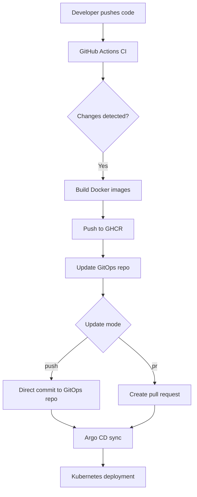

# Todo App Project

## 📦 Project Overview

The Todo App is a containerized full-stack application consisting of a frontend and backend. It is deployed using GitOps principles via Argo CD. The CI/CD pipeline builds and pushes Docker images to GitHub Container Registry (GHCR) and updates the GitOps repository with new image tags.

---

## ⚙️ CI/CD Pipeline Documentation

The CI/CD pipeline is implemented using GitHub Actions. It performs the following steps:

1. Detects changes in `src/frontend` or `src/backend`.
2. Builds and pushes Docker images to GHCR if changes are detected.
3. Uses `github.sha` as the image tag if built, otherwise fetches the latest tag from GHCR.
4. Updates the GitOps values file for the appropriate environment (`dev`, `staging`, `production`).
5. Commits changes directly or opens a pull request based on `update_mode`.

---

## CI/CD Architecture


---


### Testing

```bash
backend-tests/
├── requirements.txt       # pytest, psycopg2, etc.
├── test_api.py            # Flask API endpoint tests
├── test_integration.py    # DB integration tests
└── test_unit.py           # Unit tests with mocks
```

### ⚠️ Known Issue: Stateless Backend with Multiple Replicas

When running multiple backend replicas, each pod stores todos **in-memory**. Because Kubernetes load-balances requests across pods, refreshing the page may show an empty list if the request hits a different pod.

#### Why this happens
- The backend uses a Python list (`todos = []`) inside the container.
- No shared state between pods → each replica has its own isolated data.

#### How to fix it
To make the backend truly scalable, use a shared data store:
- **Option 1:** Add a database (PostgreSQL, MySQL, MongoDB).
- **Option 2:** Use a distributed cache (Redis).
- **Option 3:** Mount a PersistentVolume (not ideal for concurrent writes).

For production, **Option 1 or 2 is recommended**. This ensures all replicas share the same data and avoids inconsistent states.