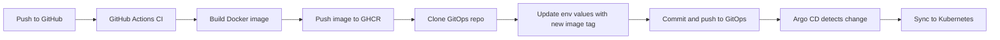

# CI/CD with GitHub Actions, GHCR, Helm & Argo CD (GitOps)

This repository documents a **working, reproducible GitOps pipeline** for Kubernetes apps using:

- **GitHub Actions** for CI/CD
- **GitHub Container Registry (GHCR)** for images
- **Helm** for templating/config
- **Argo CD** for continuous delivery (syncing the GitOps repo to your cluster)

It’s designed so that **app repos** build and publish images, then **commit only configuration changes** to a separate **GitOps repo**, which Argo CD watches and syncs automatically.

> This README is a reference for team members onboarding new services to the same pipeline model.

---

## ✨ What You Get

- Deterministic image tags (commit SHA)
- Minimal permissions (GHCR via `GITHUB_TOKEN`; GitOps repo via fine‑grained PAT)
- Automated Argo CD sync with prune & self-heal
- Clear branch → environment mapping (currently: `main → dev` for testing)

---

## 📦 Repositories & Structure

### App Repository (this one)
Holds:
- Application source code
- Dockerfile
- Workflow at `.github/workflows/ci.yml` that:
  1) Builds and pushes the image to GHCR  
  2) Clones the GitOps repo and updates the env values file  
  3) Commits/pushes the change

### GitOps Repository
Holds:
- Helm chart + templates under a chart path, e.g. `hello-world-app/`
- Environment value files under `environments/<env>/hello-world.yaml`
- Argo CD Application `manifests/` files, for creating apps for Argo CD to monitor and sync

Recommended layout:
```bash
gitops/
├── environments
│   ├── dev
│   │   ├── hello-world.yaml
│   │   └── other-app.yaml
│   ├── production
│   │   ├── hello-world.yaml
│   │   └── other-app.yaml
│   └── staging
│   │   ├── hello-world.yaml
│   │   └── other-app.yaml
├── other-app
│   ├── Chart.yaml
│   └── templates/
├── hello-world-app
│   ├── Chart.yaml
│   └── templates
│       ├── configmap.yaml
│       ├── deployment.yaml
│       ├── ingress.yaml
│       └── service.yaml
└── manifests
    ├── hello-world-dev.yaml
    └── other-app-production.yaml
```

---

## 🔁 Pipeline Flow



---

## 🧩 Argo CD Application Manifest (Example)

```yaml
apiVersion: argoproj.io/v1alpha1
kind: Application
metadata:
  name: hello-world-dev
  namespace: argocd
spec:
  project: default
  source:
    repoURL: https://github.com/VotingM7011E/gitops.git
    targetRevision: main
    path: hello-world-app
    helm:
      valueFiles:
        - ../environments/dev/hello-world.yaml
  destination:
    server: https://kubernetes.default.svc
    namespace: hello-world-dev
  syncPolicy:
    automated:
      prune: true
      selfHeal: true
    syncOptions:
      - CreateNamespace=true
```

The manifests fille currently can be applied with:
```bash
kubectl apply -f manifests/hello-world-dev.yaml
```
this creates the Argo CD application with the given sync policies. Argo CD continuously monitor the value files for new images. Deploys new images based on currently reported tag.

---

## 🧪 Dev Environment Values (Example)

```yaml
# Development Environment Configuration
app:
  name: hello-world
  replicas: 1

domain: helloworldservice-dev.example.com
email: you@example.com
environment: Development
message: "Hello from Development Environment!"

image:
  repository: ghcr.io/<org>/<repo-or-app>
  tag: <commit-sha>

ingress:
  certIssuer: letsencrypt-staging
```

---

## ⚙️ GitHub Actions Workflow (Full)

Below is the optimized workflow that:

- Uses **trigger-level paths** to avoid noisy runs.
- Adds **paths-filter** to skip expensive builds when only docs or unrelated files change.
- Builds and pushes the image with **Buildx cache** for speed.
- Compares current vs desired image tag to **avoid redundant GitOps commits**.
- Supports **PR mode** for GitOps updates (optional).

```yaml
name: Build, Push, and Update GitOps

on:
  push:
    branches: [ "main", "staging", "dev" ]
    paths:
      - 'Dockerfile'
      - 'app.py'
      - '.github/workflows/**'
      - '!**/*.md'
  workflow_dispatch:
    inputs:
      env:
        description: "Override target environment (dev|staging|production)"
        required: false
        default: ""
      update_mode:
        description: "gitops update mode (push|pr)"
        required: false
        default: "push"

concurrency:
  group: gitops-${{ github.ref }}
  cancel-in-progress: false

jobs:
  build:
    runs-on: ubuntu-latest
    permissions:
      contents: read
      packages: write
      attestations: write
      id-token: write

    env:
      IMAGE_REPO: ghcr.io/votingm7011e/hello-world
      GITOPS_REPO: votingm7011e/gitops
      GITOPS_BRANCH: main
      APP_FILE: hello-world.yaml
      GITOPS_UPDATE_MODE: ${{ github.event.inputs.update_mode || 'push' }}

    steps:
      - name: Checkout code
        uses: actions/checkout@v4
        with:
          fetch-depth: 1

      - name: Set up Docker Buildx
        uses: docker/setup-buildx-action@v3

      - name: Login to GHCR
        uses: docker/login-action@v3
        with:
          registry: ghcr.io
          username: ${{ github.actor }}
          password: ${{ secrets.GITHUB_TOKEN }}

      - name: Determine if build is needed
        id: changes
        uses: dorny/paths-filter@v3
        with:
          filters: |
            build:
              - 'Dockerfile'
              - 'app.py'
              - '.github/workflows/**'

      - name: Stop early (no build needed)
        if: steps.changes.outputs.build != 'true' && github.event_name == 'push'
        run: echo "No relevant changes; skipping." && exit 0

      - name: Build and Push Image (cached)
        id: build
        uses: docker/build-push-action@v6
        with:
          context: .
          push: true
          tags: |
            ${{ env.IMAGE_REPO }}:${{ github.sha }}
          cache-from: type=gha
          cache-to: type=gha,mode=max

      - name: Export IMAGE_TAG output
        id: tag
        run: echo "IMAGE_TAG=${{ github.sha }}" >> "$GITHUB_OUTPUT"

      - name: Resolve target environment
        id: resolve
        run: |
          INPUT_ENV="${{ github.event.inputs.env }}"
          if [[ -n "$INPUT_ENV" ]]; then
            TARGET_ENV="$INPUT_ENV"
          else
            case "${GITHUB_REF_NAME}" in
              main)    TARGET_ENV="dev" ;;
              staging) TARGET_ENV="staging" ;;
              dev)     TARGET_ENV="dev" ;;
              *) echo "Unsupported branch '${GITHUB_REF_NAME}'. Provide env via workflow_dispatch input."; exit 1 ;;
            esac
          fi
          echo "TARGET_ENV=$TARGET_ENV" >> "$GITHUB_OUTPUT"

      - name: Install yq
        run: |
          sudo wget -qO /usr/local/bin/yq https://github.com/mikefarah/yq/releases/latest/download/yq_linux_amd64
          sudo chmod +x /usr/local/bin/yq

      - name: Clone GitOps repo
        run: |
          git clone --depth 1 --branch "${{ env.GITOPS_BRANCH }}" \
            "https://x-access-token:${{ secrets.GITOPS_TOKEN }}@github.com/${{ env.GITOPS_REPO }}.git" gitops-repo

      - name: Calculate desired vs current image tag
        id: diff
        env:
          IMAGE_TAG: ${{ steps.tag.outputs.IMAGE_TAG }}
        run: |
          cd gitops-repo
          VALUES_FILE="environments/${{ steps.resolve.outputs.TARGET_ENV }}/${{ env.APP_FILE }}"
          CURRENT_REPO="$(yq '.image.repository' "$VALUES_FILE")"
          CURRENT_TAG="$(yq '.image.tag' "$VALUES_FILE")"
          if [[ "$CURRENT_REPO" == "${{ env.IMAGE_REPO }}" && "$CURRENT_TAG" == "$IMAGE_TAG" ]]; then
            echo "no_change=true" >> "$GITHUB_OUTPUT"
          else
            echo "no_change=false" >> "$GITHUB_OUTPUT"
          fi

      - name: Update values file (only when changed)
        if: steps.diff.outputs.no_change == 'false'
        env:
          IMAGE_TAG: ${{ steps.tag.outputs.IMAGE_TAG }}
        run: |
          cd gitops-repo
          VALUES_FILE="environments/${{ steps.resolve.outputs.TARGET_ENV }}/${{ env.APP_FILE }}"
          yq -i ".image.repository = \"${{ env.IMAGE_REPO }}\" | .image.tag = \"${IMAGE_TAG}\"" "$VALUES_FILE"
          if [[ "${{ env.GITOPS_UPDATE_MODE }}" == "pr" ]]; then
            BRANCH="bump/${{ steps.resolve.outputs.TARGET_ENV }}/hello-world-${IMAGE_TAG}"
            git checkout -b "$BRANCH"
          fi
          git config user.name "GitOps CI"
          git config user.email "actions@github.com"
          git add "$VALUES_FILE"
          if ! git diff --cached --quiet; then
            git commit -m "chore(${{ steps.resolve.outputs.TARGET_ENV }}): bump ${{ env.IMAGE_REPO }} to ${IMAGE_TAG} [skip ci]"
          fi
          if [[ "${{ env.GITOPS_UPDATE_MODE }}" == "pr" ]]; then
            git push -u origin "$BRANCH"
          else
            git push origin "${{ env.GITOPS_BRANCH }}"
          fi

      - name: Open PR to GitOps (PR mode)
        if: steps.diff.outputs.no_change == 'false' && env.GITOPS_UPDATE_MODE == 'pr'
        uses: peter-evans/create-pull-request@v6
        with:
          token: ${{ secrets.GITOPS_TOKEN }}
          commit-message: "chore(${{ steps.resolve.outputs.TARGET_ENV }}): bump ${{ env.IMAGE_REPO }} to ${{ steps.tag.outputs.IMAGE_TAG }} [skip ci]"
          title: "chore(${{ steps.resolve.outputs.TARGET_ENV }}): bump ${{ env.IMAGE_REPO }} to ${{ steps.tag.outputs.IMAGE_TAG }}"
          branch: "bump/${{ steps.resolve.outputs.TARGET_ENV }}/hello-world-${{ steps.tag.outputs.IMAGE_TAG }}"
          base: ${{ env.GITOPS_BRANCH }}
```

---

## 🚀 How to Add a New App

1. Create app repo with Dockerfile + workflow.
2. Set `IMAGE_REPO` to your GHCR path.
3. Prepare GitOps repo with Helm chart + env files.
4. Add Argo CD Application pointing to chart + env file.
5. Configure secrets (`GITOPS_TOKEN`).
6. Push to branch or trigger manually.
7. Verify Argo CD sync.

---

## ✅ Next Steps

- Add production env values.
- Switch `main → production` mapping.
- Integrate Cosign + SBOM.
- Consider Argo Rollouts for progressive delivery.

---

**Author:** Jacob Sjöström

**Purpose:** Reference for deploying apps using GitOps-based CI/CD pipeline.
