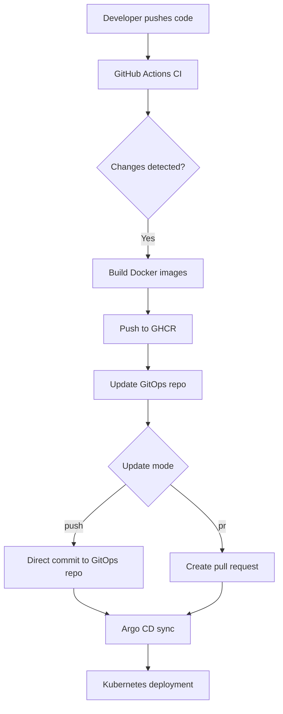

# Todo App Project

## 📦 Project Overview

The Todo App is a containerized full-stack application consisting of a frontend and backend. It is deployed using GitOps principles via Argo CD. The CI/CD pipeline builds and pushes Docker images to GitHub Container Registry (GHCR) and updates the GitOps repository with new image tags.

---

## ⚙️ CI/CD Pipeline Documentation

The CI/CD pipeline is implemented using GitHub Actions. It performs the following steps:

1. Detects changes in `src/frontend` or `src/backend`.
2. Builds and pushes Docker images to GHCR if changes are detected.
3. Uses `github.sha` as the image tag if built, otherwise fetches the latest tag from GHCR.
4. Updates the GitOps values file for the appropriate environment (`dev`, `staging`, `production`).
5. Commits changes directly or opens a pull request based on `update_mode`.

### CI/CD Architecture


---


## Setup Instructions

### Prerequisites

- GitHub repository for the Todo app (e.g., `votingm7011e/todo`)
- GitHub Container Registry (GHCR) enabled
- GitOps repository (e.g., `votingm7011e/gitops`) with environment folders:
  - `environments/dev/todo.yaml`
  - `environments/staging/todo.yaml`
  - `environments/production/todo.yaml`
- Argo CD configured to watch the GitOps repository
- GitHub Secrets configured:
  - `GITHUB_TOKEN` (automatically provided by GitHub Actions)
  - `GITOPS_TOKEN` (Personal Access Token with repo write access)

### GitHub Actions Setup

1. Place the CI workflow file in `.github/workflows/ci.yml`.
2. Place the dispatch workflow file in `.github/workflows/dispatch.yml`.
3. Ensure the `GITOPS_TOKEN` secret is added to the repository settings.
4. Push changes to `main`, `staging`, or `dev` branches to trigger the CI.
5. Optionally, trigger the workflow manually using the `Dispatch Todo App CI` workflow.

### Argo CD Setup

1. Configure Argo CD to track the `gitops` repository.
2. Create three applications in Argo CD:
   - `todo-dev` → `environments/dev/todo.yaml`
   - `todo-staging` → `environments/staging/todo.yaml`
   - `todo-production` → `environments/production/todo.yaml`
3. Enable auto-sync or manual sync as needed.


## Testing

```bash
backend-tests/
├── requirements.txt       # pytest, psycopg2, etc.
├── test_api.py            # Flask API endpoint tests
├── test_integration.py    # DB integration tests
└── test_unit.py           # Unit tests with mocks
```

### ⚠️ Known Issue: Stateless Backend with Multiple Replicas

When running multiple backend replicas, each pod stores todos **in-memory**. Because Kubernetes load-balances requests across pods, refreshing the page may show an empty list if the request hits a different pod.

#### Edit: Added postgresql database